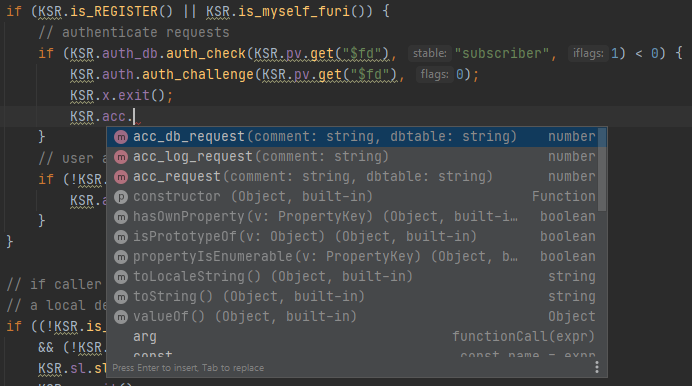

# Kamailio-Typescript
If you are like me, and hate to work with code that doesn't autocomplete. 
Fear not because I have been making the groundwork for converting the KEMI Javascript module into Typescript.

All that this does, is to allow for autocomplete, and type correcting, of the code you write.

So far this ONLY works on Jetbrains Webstorm/PHPStorm.
If anyone knows a way to get it working on Atom or VSCode, please write to me. 

## Things that it doesn't do
* Tell you if the method is allowed in the current route

## TODO
* Add JSDoc, with descriptions, return types and examples
* Add enum parameters, for the parameters that e.g. can be a specific set of strings
* Make it work on ATOM & VSCode

## Usage
I have been testing it out with PHPStorm/Webstorm.

### Jetbrains Webstorm/PHPStorm
1. Clone the repo down to your computer
2. Open your kamailio project, and go into settings.
3. Find 'Languages & Frameworks > JavaScript > Libraries'
4. Add a new Library
5. Name the library what you want, and attach the repo to library

### Usages
As the image proves, it's now possible to autocomplete, and check if the parameters are of the correct type

